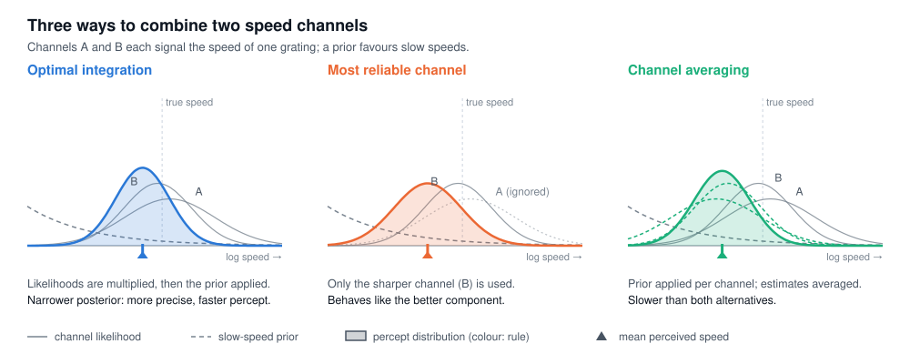

# signal-integration

Interactive companion to

> M. Jogan and A. A. Stocker (2015). **Signal integration in human visual speed perception.**
> *Journal of Neuroscience* 35(25):9381–9390. doi:[10.1523/JNEUROSCI.4801-14.2015](https://doi.org/10.1523/JNEUROSCI.4801-14.2015)

**▶ [Run the experiment](https://matjazjogan.github.io/signal-integration/)**

A moving object excites many spatiotemporal frequency channels at once, yet we perceive a single speed. In this study we asked how the visual system combines these signals. We measured speed discrimination for stimuli that each targeted a single channel, fitted a Bayesian observer with a prior for slow speeds, and predicted perception of stimuli that drive several channels at once. Only an observer that integrates the channel likelihoods optimally, before applying the prior, accounted for the data; observers that rely on the most reliable channel or average per-channel estimates did not.

`index.html` lets anyone repeat a two-channel version of the experiment in the browser and see the same analysis applied to their own responses. It is a single self-contained page.

## Experiment

Observers compare the speeds of two band-limited noise gratings (bandwidth 0.04 ωs, 4° raised-cosine aperture, 6° eccentricity, 600 ms). The test drifts at 3°/s, and the reference speed follows two interleaved staircases per condition. A white square then marks one grating and the observer reports whether it was faster or slower, which keeps response bias out of the measurement.

| Run | Conditions (test / reference) | Role |
| --- | --- | --- |
| 1 | A / R, R / R | fit |
| 2 | B / R, R / R | fit |
| 3 | A+B / R | predicted |

A and B are single-channel gratings, by default 1 and 2 c/° at 9% and 13% contrast, the values of our original calibration; R is a broadband reference (octave bands from 0.5 c/° up to the higher test frequency, as our ABCD stimulus) at high contrast. The page measures the display refresh rate and caps reference speeds so that no grating aliases in time. A bank-card match and the viewing distance calibrate the display in degrees of visual angle. Contrast is nominal, as the display is not gamma-corrected.

## Model

Speed is represented as s = log(1 + v/0.3). Each channel contributes a Gaussian likelihood of width σX, and the prior is locally log p(s) = as + b. For a compound stimulus the three observers predict

| Model | Mean of percept | Variance of percept |
| --- | --- | --- |
| Optimal integration | s + aσ², with 1/σ² = Σ 1/σX² | σ² |
| Most reliable channel | s + aσmin² | σmin² |
| Channel averaging | s + (a/k) Σ σX² | Σ σX² / k² |

The models coincide for single channels, so σA, σB, σR and a are fitted once, by maximum likelihood, to runs 1 and 2. The reference-against-reference condition fixes σR, as our balanced ABCD condition did; each test-against-reference function then yields σX from its slope, √(σX² + σR²), and a from its PSE, a(σX² − σR²). Run 3 is then predicted without free parameters, and the models are compared by goodness of prediction: the negative log-likelihood of the run-3 responses, scaled between chance and the empirical response proportions.

The prior exponent is critical for separating optimal integration from the most reliable channel. The latter predicts that the compound behaves like the better channel, which is measured directly, whereas the optimal prediction extrapolates through a(σ² − σR²). A sharp reference therefore matters, and the analysis reports how often the verdict survives bootstrap refits of runs 1 and 2. In simulations with the standard session (280 trials) and σR ≈ 0.18, optimal integration is separated from the most reliable channel in 70–90% of sessions. The *Simulated observer* tab runs the full procedure on a model observer, including a 50-session recovery test.

A correction to the paper: in Fig. 3b the SD of the balanced psychometric function should read √2·σTest, not σTest/√2, as the Methods (σ = 0.6/√2) and Fig. 3c imply. The analysis uses √2·σTest.

Notes for running the study and collecting data are in [SETUP.md](SETUP.md).
